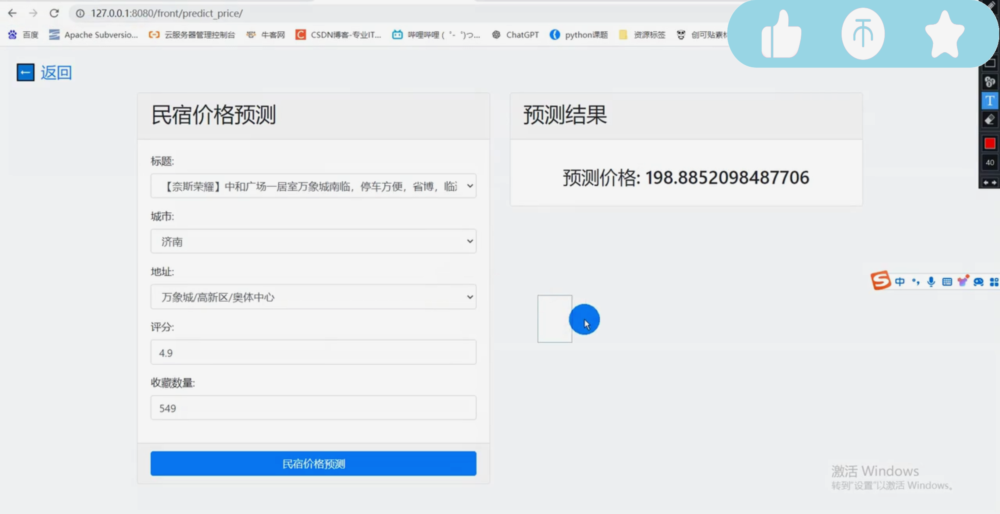

## 计算机毕业设计Python民宿可视化分析 民宿推荐系统 随机森林预测算法 民宿爬虫 酒店爬虫 大数据毕业设计 Django Vue.js 机器学习 深度学习

## 要求
### 源码有偿！一套(论文 PPT 源码+sql脚本+教程)

### 
### 加好友前帮忙start一下，并备注github有偿纯python小说推荐
### 我的QQ号是2827724252或者798059319或者 1679232425或者微信:bysj2023nb 或bysj1688

# 

### 加qq好友说明（被部分 网友整得心力交瘁）：
    1.加好友务必按照格式备注
    2.避免浪费各自的时间！
    3.当“客服”不容易，repo 主是体面人，不爆粗，性格好，文明人。

## 演示视频
https://www.bilibili.com/video/BV1Fw4m1C7Ap/?spm_id_from=333.999.0.0

## 功能
计算机毕业设计|基于Python的民宿可视化分析+随机森林预测算法 民宿爬虫 酒店爬虫 民宿可视化分析（新出）
算法都是选装 除了随机森林预测算法外 还可以加其他算法 可定制大数据 java net php 小程序等

## 运行截图

